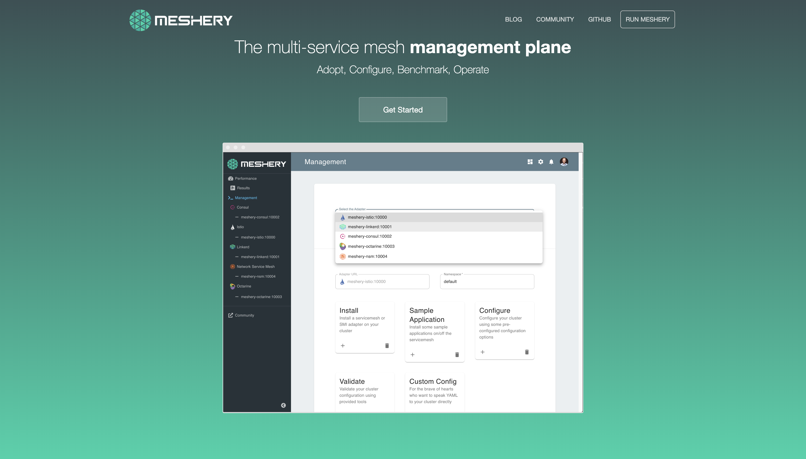

# Meshery.io


*Visit [Meshery.io](https://meshery.io/) to learn more!*

## What is Meshery?
Meshery is a multi-service mesh management plane adopting, operating, and developing on different service meshes. Meshery facilitates learning about functionality and performance of service meshes. It incorporates the collection and display of metrics from applications running on or across service meshes. At a high level, Meshery provides performance benchmarking, service mesh lifecycle management, and service mesh interoperability and federation.

For further information, refer to the [Meshery Docs](https://meshery.layer5.io/docs/).

## Contributing to Meshery

Before contributing, please review the [Contribution Flow](https://github.com/layer5io/meshery/blob/master/CONTRIBUTING.md). In the following steps you will set up your development environment, fork and clone the repository, run the site locally, and finally commit, sign-off, and push any changes made for review.

### 1. Set up your development environment

* *The Meshery site is built using Jekyll - a simple static site generator! You can learn more about Jekyll and setting up your development environment in the [Jekyll Docs](https://jekyllrb.com/docs/).*

* First [install Ruby](https://jekyllrb.com/docs/installation/), then install Jekyll and Bundler.

### 2. Get the code

* Fork and then clone the [Meshery.io repository](https://github.com/layer5io/meshery.io)
  ```bash
  $ git clone https://github.com/YOUR-USERNAME/meshery.io
  ```
* Install any Ruby dependencies
  ```bash
  $ bundle install
  ```

### 3. Serve the site

* Serve the code locally
  ```bash
  $ make site
  ```
  *Note: From the Makefile, this command is actually running `$ bundle exec jekyll serve --drafts --livereload`*

### 4. Create a Pull Request

* After making changes, don't forget to commit with the sign-off flag (-s)!
  ```bash
  $ commit -s -m “my commit message w/signoff”
  ```
* Once all changes have been committed, push the changes.
  ```bash
  $ git push origin <branch-name>
  ```
* Then on Github, navigate to the [Meshery.io repository](https://github.com/layer5io/meshery.io) and create a pull request from your recently pushed changes!
